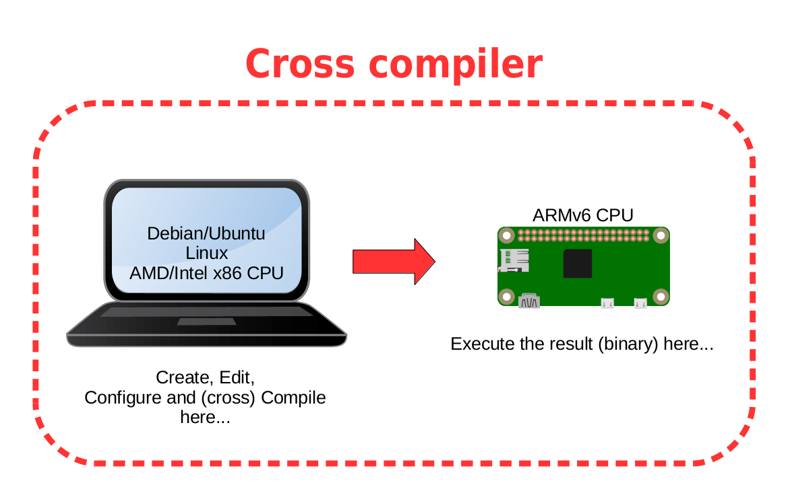
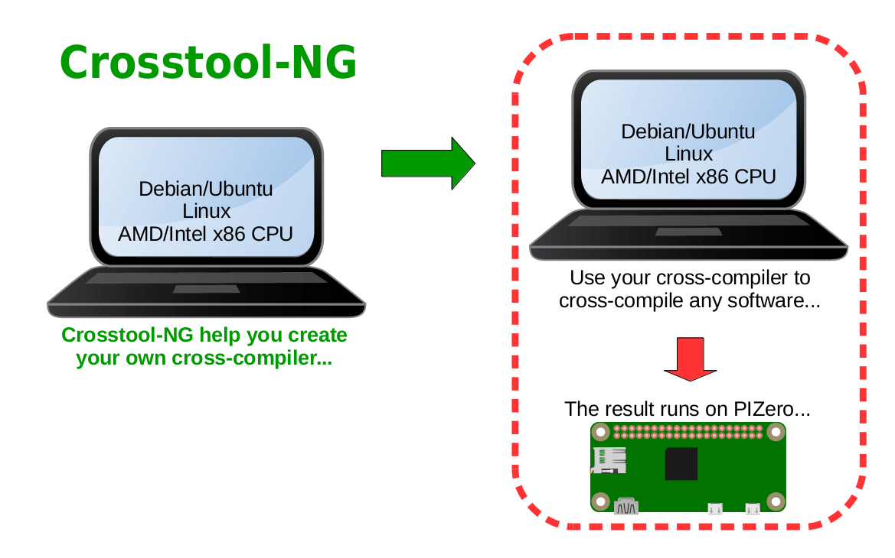
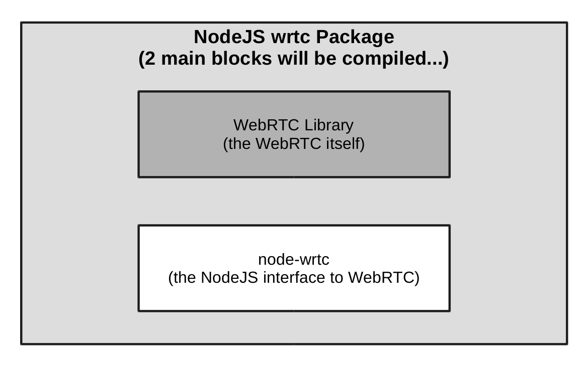
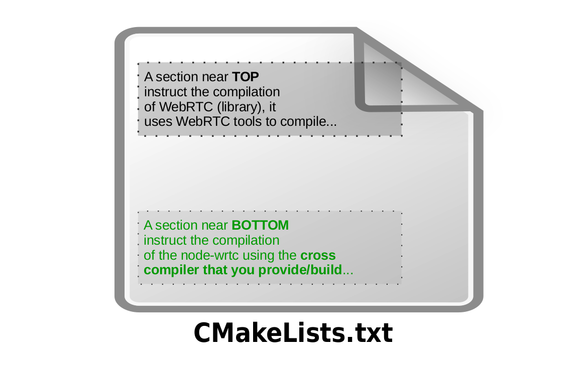

# Node WebRTC f/ source for armv6 RaspberryPI Zero
**Build Node-WebRTC From Source for armv6 Raspberry PI Zero**
2019/August

This tutorial is about building NodeJS WRTC Module from source code, targeting the ARMv6 on a Raspberry PI Zero, using an AMD/Intel x86 Desktop PC with GNU/Linux as the development system.
The procedure also builds the WebRTC library (used by the NodeJS WRTC Module).

A cross compiler (x86 to armv6) is needed, so in August/2019 I searched for a recent version of the a Cross GCC Compiler to use and did NOT found one (a GCC version 5.4 was/is needed), so I decide to investigate about how to build one myself, which turn out to be quite easy, by using the Crosstool-NG builder.

I succeed, and the result is that WebRTC DataChannel is working on the RPI Zero.

**WebTorrent.**  
I was very happy to see that WebTorrent is also working on the RPI Zero, using the same binary result achieved by the compilation process.


**Here are the 3 steps, in its overview/simple form:**

1) Using Crosstool-NG and the provided configuration file, build your own cross compiler x86 to ARMv6.

2) Then, go to the Node-Wrtc Github page and follow the provided preparations instructions (install needed soft, etc), that already exists for cross compilation for ARMv7 and ARMv8.

3) Use the 2 modified scripts provided here, replace the existing originals with these (modified) ones, and run the cross compilation process.


**Here are the steps in more details:**  

**STEP 1**  
We need a cross compiler, so we can use a fast desktop AMD/Intel computer and compile software for the RaspberryPI.  


The software Crosstool-NG can build a cross compiler for you.  


**Lets install Crosstool-NG:**  
First, we need to install some software that are required (dependencies) by Crosstool-NG:  
```sudo apt install gcc g++ gperf bison flex texinfo  
sudo apt install help2man make libncurses5-dev  
sudo apt install python3-dev autoconf automake  
sudo apt install libtool libtool-bin gawk wget bzip2  
sudo apt install xz-utils unzip patch libstdc++6  
```

Then, download the crosstool-ng, open a terminal shell and unpack it:[Crosstool-NG Website](https://crosstool-ng.github.io/)  
```
tar -xjf ./crosstool-ng-1.24.0.tar.bz2
```

Enter the folder:  
```
cd crosstool-ng-1.24.0/  

./configure  --enable-local

make
```

Now you are ready to go.  
We need to configure Croostool-NG with options that we wanted, or, just use a pre configured configuration file, like the one which is provided here ("config-armv6zkRPIzero-V2").  

Copy the file "config-armv6zkRPIzero-V2" to the Crosstool-NG folder and rename it as ".config" (dot config).  

```Run "./ct-ng build"```

In the end, your new cross compiler will be on your "/home/directory/xtools"...


**STEP 2**  
NodeJS WRTC Module uses WebRTC Library, which is part of Chromium Browser Project, and so we need to install some software needed to compile WebRTC/Chromium. There is a script that install all the software (dependencies) for us. We need to run this following script.  

Script [install-build-deps.hs](https://cs.chromium.org/chromium/src/build/install-build-deps.sh)  

If you want/need a full reference about the script, [here is the page.](https://webrtc.org/native-code/development/prerequisite-sw/)  


**STEP 3**  
The NodeJS-WRTC Page to build from source is here:  
[GitHub Node-WRTC Build from Source](https://github.com/node-webrtc/node-webrtc/blob/develop/docs/build-from-source.md)  
To compile NodeJS-WRTC Module, you will follow the sames little steps described on the page, with 3 small changes:  

Get the source files:  
```
git clone https://github.com/node-webrtc/node-webrtc.git
```

First, inside the directory node-webrtc you will find a file called "CMakeLists.txt", replace it with the one that is provided here. Just copy over it.  

Second, inside the directory node-webrtc/scripts you will find a file called "configure-webrtc.sh", replace it with the one that is provided here. Just copy over it.  
You may need to set correct execute permission of the file "configure-webrtc.sh", to do this just run:  
```
chmod +x configure-webrtc.sh
```

Be sure to be on the same directory that the file itself is located!  


Third, use the following command line to invoke the compilation process, pointing the process to use the cross compiler that you are providing:

```
SKIP_DOWNLOAD=true  TARGET_ARCH=armv6  ARM_TOOLS_PATH=/path/to/your/cross/compiler/folder  npm  install
```

This is it. Wait until finish...  

Two main blocks will be build...  


The WebRTC Library and NodeJS WRTC Module...  


The CMakeLists.txt file hold the instructions...  



At the end, the folder "node-webrtc/build/Release" will have the resulting binary file (wrtc.node), good for use on the Raspberry PI Zero.  

You will need to place this file inside "node_modules/wrtc/build/Release" folder of your NodeJS project/sample code, replacing the original that should be there, BUT AT THE PRESENT TIME, IT IS NOT WORKING PROPERLY!  
The official support for NodeJS-WebRTC is for armv7 and armv8, so, it works for RPI2, RPI3 etc... but fail on the RPIZero...  

On the RaspberryPI Zero, when you run the command "npm install wrtc", the process will install the node-wrtc module but the binary component wrtc.node will not work (as of 2019/AUGUST), you then need to replace it with the one that you have compiled...  


**Software Versions used:**
AUGUST/2019
- Developed on GNU/Linux Ubuntu 18.04 x86 64Bits
- Crosstool-NG version: 1.24.0
- Node-wrtc version: 0.4.1
- WebRTC version: M76  

**Tested on:**
- Raspberry PI 3 Raspbian 10 Buster
- NodeJS 10.16.0 armv7l
- Raspberry PI Zero WH Raspbian 10 Buster
- NodeJS 10.16.0 armv6l  


My goal for doing this compilation (WRTC4ARMV6) was to achive WebRTC Datachannel on a Raspberry PI Zero, and I achieve success after reading and trying...
The emphasis here is "DataChannel" and "RPI Zero".
For the RPI2 and better, audio and video are items that I doo consider, but for the RPI Zero, I want to keep things at DataChannel ONLY...  

Everything looks very simple now, because I know the details, but, in the beginning I had to use try/error/learn to gain knowledge on the whole process. I was only able to find small amount of information online on the subject of WebRTC on RPIZero, and some portions related to old versions of the software and no longer are the correct thing to do and to know... 

Then, considering that it is a relatively easy task, and unleash a interesting practical result, I decide to create this tuto in the way it is presented here...  

**About Updates/Upgrades**  
RasPI OS, NodeJS, WebRTC and WebTorrent software(s) keep evolving every single day, changing, making small adjustments... at some point, the procedures reported here will need some minor corrections/updates, or will completely cease to perform its functions, at such point, I hope somebody can fork/copy the instruction/scripts here and make available the infos to support future evolution of all the implicated pieces of code.

Hopefully, the text, scripts and diagrams I am providing here helps the reader to get a good basic understanding of the subject (RPIZ / WebRTC), enough to identify any future potential issues that may appear and resolves them.
